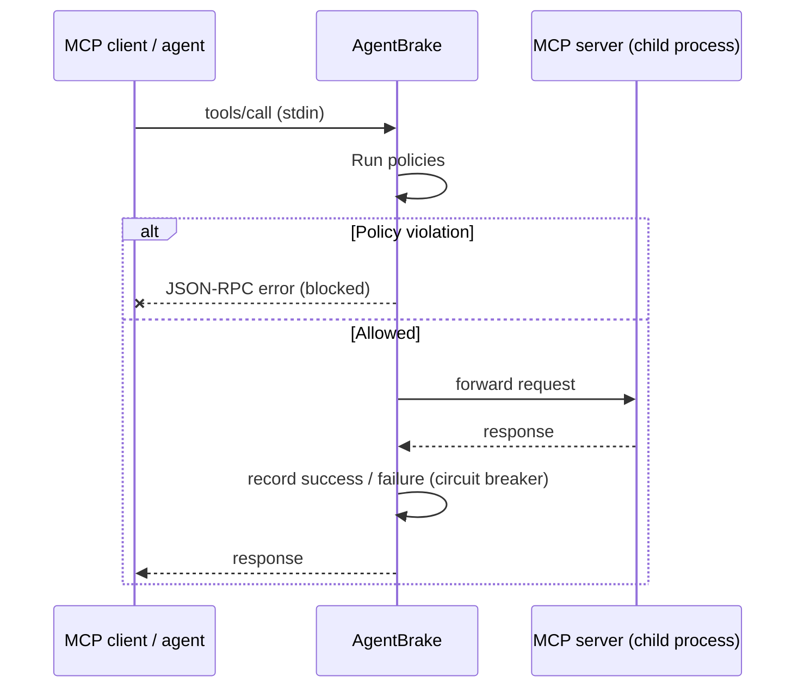

# AgentBrake

**A policy-enforcing proxy for MCP tool calls over stdio.**

[](https://opensource.org/licenses/MIT)

> "Run AI agents at full throttle, without losing control."

AgentBrake is a **Model Context Protocol (MCP) stdio proxy**. It launches your MCP server as a child process, sits between the MCP client (your agent host) and that server, and evaluates every `tools/call` request against a set of policies before forwarding it. Calls that violate a policy are answered with a JSON-RPC error and never reach the server.

It is a guard rail for cooperative-but-fallible agents, **not a sandbox**. Read [Security model & limitations](#security-model--limitations) before relying on it.

---

## Quick Demo: Stop a Rogue Agent

See AgentBrake intercept a simulated "rogue agent" trying to read secrets and run destructive commands.

### Option 1: Local (Node.js >= 18)

```bash
npm install
npm run build
npm run demo:rogue      # rogue agent attack simulation
npm run demo:research   # research agent workflow
```

### Option 2: Docker

```bash
# Runs the Research Agent demo (it spawns the proxy internally)
docker compose up --build
```

**What you will see:**
- Allow: calls that satisfy every policy pass through to the tool server.
- Block: argument rules stop access to secrets such as `.env` and `.aws/credentials`.
- Approval-required tools are refused with a "pending" error (see [Human approval](#human-approval-not-implemented)).
- A `kill` rule ends the proxy, so later demo steps show a timeout. That is expected.

---

## Features

| Feature | Status |
|---|---|
| Tool allow-list / deny-list | Implemented |
| Per-argument regex rules (`allow_if` / `deny_if`) | Implemented (heuristic, see limitations) |
| Max tool calls, max runtime, rate limit | Implemented |
| Circuit breaker (per tool, driven by real tool results) | Implemented |
| Estimated-cost budget | Implemented (flat per-call estimate, not real spend) |
| Fail-closed framing, config and policy handling | Implemented |
| Structured JSON logs (violations, warnings, lifecycle) on stderr | Implemented |
| Human-in-the-loop approval | **Not implemented** (tools are refused; there is no way to approve) |
| Slack / webhook notifications | **Not implemented** (`WebhookNotifier` exists but is not wired in) |
| Sandbox isolation / trust levels | **Not implemented** (a `sandbox` action is enforced as `block`) |
| Non-stdio transports (HTTP/SSE) | **Not supported** |

---

## How It Works

1. **Intercept:** the client writes newline-delimited JSON-RPC to AgentBrake's stdin. Input is buffered into complete lines (bytes are split on `\n` and only then decoded, so messages split across reads, or containing multi-byte characters, are handled).
2. **Evaluate:** each `tools/call` (or `call_tool`) request runs through the policy chain in order. Requests are handled strictly one at a time, in arrival order.
3. **Enforce:**
   - **Allow:** the request is forwarded to the server. Responses are relayed line by line.
   - **Block:** the client receives a JSON-RPC error (`-32000`; `data.policy` names the policy). The server never sees the request.
   - **Kill:** the client receives the error, the child process is terminated and AgentBrake exits with code 1.
   - **Approval required:** the client receives error `-32001` with `status: "pending"`; the call is not forwarded.
   - **Warn:** logged, then forwarded.
4. **Observe:** when the server answers a forwarded call, the outcome is fed to the circuit breaker (a JSON-RPC `error`, or `result.isError: true`, counts as a failure).

Policies run in this order: max tool calls, max runtime, rate limit, denied tools, allowed tools, granular rules, approval, circuit breaker, budget. The first policy that blocks stops evaluation. `max_tool_calls` counts calls that were actually forwarded.


```mermaid
sequenceDiagram
    participant Agent as MCP client / agent
    participant Brake as AgentBrake
    participant Tool as MCP server (child process)

    Agent->>Brake: tools/call (stdin)
    Brake->>Brake: Run policies
    alt Policy violation
        Brake--xAgent: JSON-RPC error (blocked)
    else Allowed
        Brake->>Tool: forward request
        Tool-->>Brake: response
        Brake->>Brake: record success / failure (circuit breaker)
        Brake-->>Agent: response
    end
```

---

## Configuration

AgentBrake looks for a config file in this order:

1. the `AGENT_BRAKE_CONFIG` environment variable (a path),
2. `./agent-brake.yml`, `./agent-brake.yaml`, `./agent-brake.json` in the working directory.

`examples/enterprise-config.yml` is a complete example.

```yaml
version: "3.0"
agent:
  name: "production-agent"

policies:
  limits:
    max_tool_calls: 100          # calls allowed to reach the server (0 = none)
    max_runtime_seconds: 3600    # checked when a tool call arrives, not a hard timer
    rate_limit:
      calls_per_window: 30
      window_seconds: 60
    budget:
      max_cost: 50.0             # compared against an estimate of $0.01 per call
    circuit_breaker:
      failure_threshold: 5       # consecutive failures of one tool
      reset_timeout_seconds: 60

  security:
    denied_tools: ["execute_shell"]
    allowed_tools:               # if set, every other tool is blocked
      - "read_file"
      - "search_web"
    require_approval: ["send_email"]   # currently always refused, see below
    granular_rules:
      - tool: "read_file"
        deny_if:
          arguments:
            path: ".*(password|secret|\\.env).*"
        action: "kill"           # warn | block | kill | request_approval (sandbox = block)
```

**Strict validation.** Unknown keys are rejected, so a typo such as `allowed_tool` stops startup instead of silently disabling a policy. Some fields are accepted but have no effect yet: `agent.trust_level`, `policies.global.*`, `budget.currency` and `budget.warn_threshold` (the budget warning is fixed at 80%).

### Fail-closed configuration

| Situation | Behaviour |
|---|---|
| Config file is malformed, fails validation, or contains an invalid/dangerous regex | **Refuses to start** (exit code 2) with an error naming the problem |
| `AGENT_BRAKE_CONFIG` points at a missing file | **Refuses to start** |
| A discovered `agent-brake.*` file is broken | **Refuses to start** (it is never skipped) |
| No config file exists anywhere | Starts with built-in defaults: no allow-list, only a **10 call cap** (a warning is logged) |
| `AGENT_BRAKE_ALLOW_INVALID_CONFIG=1` and the config is invalid | Starts with the built-in defaults **instead of your policies**. Explicit opt-in; a loud warning is logged. |

### Environment variables

| Variable | Meaning |
|---|---|
| `AGENT_BRAKE_CONFIG` | Path to the config file |
| `AGENT_BRAKE_ALLOW_INVALID_CONFIG` | `1`/`true`: fall back to defaults if the config is invalid (not recommended) |
| `AGENT_BRAKE_MAX_MESSAGE_BYTES` | Max size of one client message line (default 10 MiB); larger messages are rejected |

---

## Installation

AgentBrake is used as a wrapper command: `agent-brake <server command> [args...]`.

### From source

```bash
npm install
npm run build
AGENT_BRAKE_CONFIG=./my-config.yml node dist/src/proxy/index.js node path/to/your/server.js
```

The package also declares an `agent-brake` binary (`dist/src/proxy/index.js`). In an MCP client config, use AgentBrake as the `command` and put your real server after it:

```json
{
  "mcpServers": {
    "files": {
      "command": "node",
      "args": ["/path/to/AgentBrake/dist/src/proxy/index.js", "node", "/path/to/server.js"],
      "env": { "AGENT_BRAKE_CONFIG": "/path/to/my-config.yml" }
    }
  }
}
```

The server command is started **without a shell**. On Windows that means shell shims such as `npx` (a `.cmd` file) will not start; use `node script.js` or the full path to an `.exe`.

### Docker

The image contains the proxy at `/app/dist/src/proxy/index.js` and runs as a non-root user. It does **not** listen on any port: the proxy speaks MCP over stdin/stdout, so run it with `-i`, and it can only wrap a server that exists inside the image.

```bash
docker build -t agentbrake .
docker run -i --rm \
  -v "$PWD/my-config.yml:/app/agent-brake.yml:ro" \
  agentbrake node dist/src/proxy/index.js node dist/examples/enterprise-tools.js
```

To wrap your own server, build an image `FROM` this one that adds it. Inside the container the default config path is `/app/agent-brake.yml`. No prebuilt image is documented here; build it yourself.

### Logging and secrets

- Logs are single-line JSON on **stderr**. AgentBrake does not write log files.
- Tool arguments and results are never logged. Values under sensitive-looking keys (`token`, `password`, `secret`, `api_key`, ...) are redacted and strings over 500 characters truncated in any logged context.
- Only the executable name and argument count of the wrapped command are logged (arguments can contain secrets).
- `AGENT_BRAKE_*`, `WEBHOOK_URL` and `SLACK_WEBHOOK_URL` are removed from the wrapped server's environment; the rest of the environment is passed through unchanged.

---

## Human approval (not implemented)

`require_approval` marks tools that should need a human decision. The workflow is **not** finished: there is no channel through which a human can approve a call, and the webhook/Slack notifier is not connected. As shipped, a tool in `require_approval` is **always refused** (first attempt: error `-32001` "pending"; repeats: blocked). `ApprovalPolicy.approve()` / `deny()` exist as library methods only. Treat this option as a stricter deny-list for now.

---

## Security model & limitations

**What AgentBrake is:** an application-level filter for `tools/call` messages on a single MCP stdio connection.

**What it is not:**
- **Not a sandbox.** It cannot restrict what an allowed tool does. Once a call is forwarded, the server runs with whatever privileges you gave it. Run untrusted servers in a container or VM with least privilege.
- **Stdio only.** HTTP/SSE/streamable-HTTP transports are not proxied. A client that can reach the server another way bypasses AgentBrake entirely.
- **Per-argument regex rules are bypassable.** A rule such as "deny `\.env`" is a string match on the argument. Encodings, path tricks (`/tmp/../etc/passwd` satisfies `^/tmp/`), symlinks, shell quoting, alternate tools, or indirect references can evade it. Prefer `allowed_tools` plus a narrow server over blocklist regexes. Non-string arguments are matched against their JSON text.
- **Regex safety is best-effort.** Patterns are compiled at startup; patterns over 512 characters or with nested quantifiers such as `(a+)+` are rejected, and argument values over 8192 characters are never regex-tested (they fail closed: treated as a deny match / allow mismatch). This reduces, but does not eliminate, ReDoS risk.
- **The budget is an estimate** (flat $0.01 per call), not measured spend. `max_runtime_seconds` and the rate limiter are evaluated only when a tool call arrives.
- **Only `tools/call` is policed.** Other MCP methods (listing tools, resources, prompts, ...) pass through unchanged.
- **JSON-RPC batches are rejected** (current MCP revisions do not use them).

**What fail-closed means here.** On the enforcement path, anything AgentBrake cannot positively classify is refused rather than forwarded:
- a line that is not valid UTF-8 or valid JSON, is not a JSON object, or exceeds the size limit gets a JSON-RPC error (`id: null` when the id is unknown) and is not forwarded;
- a `tools/call` with a missing/invalid `params.name` or non-object `arguments` is rejected;
- if a policy throws, the call is blocked;
- an unknown policy action, or `sandbox` (not implemented), is enforced as a block;
- forwarded messages are re-serialised from the parsed value, so the server sees exactly what the policies checked (no duplicate-key tricks);
- server output that is not valid JSON is dropped, not relayed.

---

## Roadmap

- [x] **V1:** Basic allow/block policies
- [x] **V2:** Regex argument rules and logging
- [x] **V3:** Circuit breaker, budget estimate, fail-closed handling, Docker packaging
- [ ] Human-in-the-loop approval channel (approve/deny) and notification wiring
- [ ] Sandbox isolation, trust levels, multi-agent support

---

## Contributing

Pull requests are welcome. Please run `npm test` and `npx tsc --noEmit` before submitting.

## License

MIT © Ujjwal Jain
