# AgentBrake 🛡️

**The Safety Control Plane for AI Agents.**

[](https://opensource.org/licenses/MIT)
[](https://hub.docker.com/r/ujjwaljain16/agentbrake)

> **"Run AI agents at full throttle — without losing control."**

AgentBrake is a transparent **Model Context Protocol (MCP)** proxy that enforces safety policies on AI tool calls in real-time. It sits between your agent (Archestra, LangChain, etc.) and your tools, blocking dangerous actions before they happen.

---

## 🚀 Quick Demo: Stop a Rogue Agent

See AgentBrake intercept a simulated "Rogue Agent" trying to steal secrets.

### Option 1: Docker (Recommended)

```bash
# Start the Research Agent demo (Blocks attacks + HITL automatically)
docker compose up --build
```

### Option 2: Local (Node.js)

```bash
npm install
npm run build
npm run demo:rogue
```

**What you'll see:**
- ✅ **Allow:** Safe tools (calculator) pass through.
- 🛡️ **Block:** DLP rules stop access to `/app/.env`.
- ⏳ **HITL:** Critical actions trigger Human-in-the-Loop approval.

---

## ✨ Features

- **🛡️ Semantic Firewall:** Block tools based on arguments (regex), not just names.
  - *Example:* Allow `read_file` only for `/tmp/*`. Block `*.env`.
- **💰 Budget Enforcement:** Limit spending per session (Mock currency or token counts).
- **🔌 Circuit Breaker:** Auto-cut connection if tools fail repeatedly (e.g., 5 errors in 60s).
- **👮 Human-in-the-Loop:** Pause execution for approval via Slack/Webhook for sensitive actions.
- **📜 Policy-as-Code:** Configure everything via a single YAML file (`enterprise-config.yml`).
- **📊 JSON Logging:** Structured logs for every decision (`ALLOW`, `BLOCK`, `KILL`).

---

## 🏗️ How It Works

AgentBrake operates as a **transparent proxy** between your AI Agent (the client) and its Tools (the server).

1.  **Intercept:** The agent sends a JSON-RPC request (e.g., `call_tool: search_web`) to AgentBrake.
2.  **Evaluate:** AgentBrake pauses the request and runs it through the **Policy Engine**, checking:
    -   **Identity:** Is this agent allowed to use this tool?
    -   **Content:** Do the arguments match DLP blocklists (e.g., regex for `.env`)?
    -   **Context:** Has the budget been exceeded? Is the tool failing repeatedly?
    -   **Approval:** Does this specific action require human verification?
3.  **Enforce:**
    -   ✅ **ALLOW:** Request is forwarded to the actual tool. Result is returned to the agent.
    -   🛡️ **BLOCK:** Request is rejected. The agent receives a standard error (e.g., "Access Denied").
    -   🛑 **KILL:** The entire session is terminated immediately (for high-risk violations).
    -   ⏳ **HITL:** The system waits for an external signal (e.g., webhook/Slack) before proceeding.

### Architecture Diagram

```mermaid
sequenceDiagram
    participant Agent as 🤖 AI Agent
    participant Brake as 🛡️ AgentBrake
    participant Admin as 👩‍💻 Human Admin
    participant Tool as 🏢 Real Tool

    Agent->>Brake: Call Tool (read_file)
    Brake->>Brake: Check Policies (DLP, Budget)
    
    alt Policy Violation
        Brake--xAgent: 🚫 Blocked / Access Denied
    else Sensitive Action
        Brake->>Admin: 📩 Request Approval
        Admin-->>Brake: ✅ Approve
        Brake->>Tool: Forward Request
        Tool-->>Brake: Result
        Brake-->>Agent: Result
    else Safe Action
        Brake->>Tool: Forward Request
        Tool-->>Brake: Result
        Brake-->>Agent: Result
    end
```



---

## ⚙️ Configuration

Create an `enterprise-config.yml` (or mount it in Docker):

```yaml
version: "3.0"
agent:
  name: "production-agent"
  trust_level: "sandbox"

policies:
  global:
    on_violation: "block"

  limits:
    budget:
      max_cost: 50.0
      warn_threshold: 0.8
    circuit_breaker:
      failure_threshold: 5
      reset_timeout_seconds: 60

  security:
    allowed_tools:
      - "read_file"
      - "search_web"
    
    # Granular DLP Rules
    granular_rules:
      - tool: "read_file"
        deny_if:
          arguments:
            path: ".*(password|secret|\\.env).*"
        action: "kill"
```

---

## 📦 Installation

### Docker (Generic)
```yaml
services:
  agent-brake:
    image: ujjwaljain16/agentbrake:latest
    volumes:
      # Mount your config to /app/agent-brake.yml (default lookup path)
      - ./my-config.yml:/app/agent-brake.yml:ro
    environment:
      # Or specify a custom path
      - AGENT_BRAKE_CONFIG=/app/custom-config.yml
    ports:
      - "3000:3000"
```

### NPM
```bash
npm install
npm run build
# Wrap your MCP server
AGENT_BRAKE_CONFIG=./my-config.yml node dist/proxy/index.js node path/to/your/server.js
```

---

## 🛣️ Roadmap

- [x] **V1:** Basic Allow/Block Policies
- [x] **V2:** Regex DLP & Logging
- [x] **V3:** Resilience (Circuit Breaker, Budget, HITL) & Docker
- [ ] **V4:** Sandbox isolation & Multi-agent orchestration support

---

## 🤝 Contributing

Pull requests are welcome! Please run `npm test` before submitting.

## 📄 License

MIT © Ujjwal Jain
